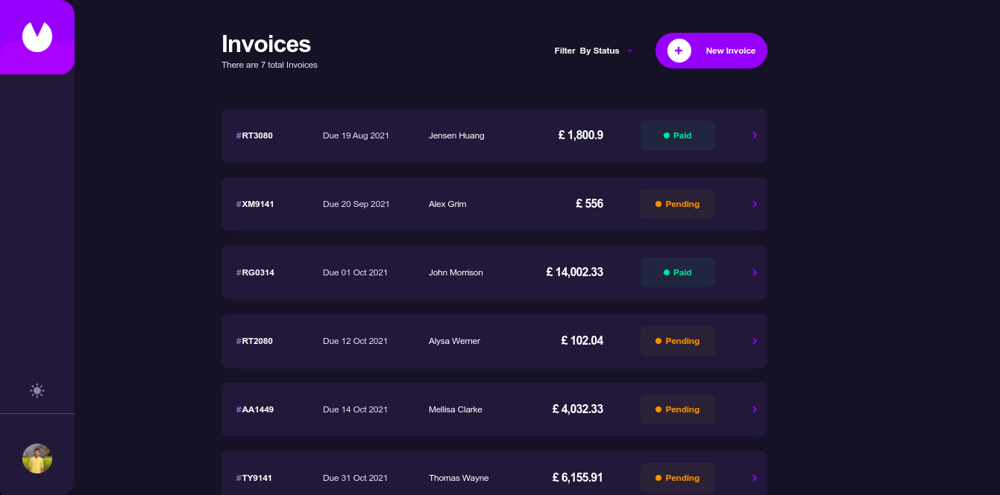

# Frontend Mentor - Invoice app solution

This is a solution to the [Invoice app challenge on Frontend Mentor](https://www.frontendmentor.io/challenges/invoice-app-i7KaLTQjl). Frontend Mentor challenges help you improve your coding skills by building realistic projects.

## Table of contents

- [Overview](#overview)
  - [The challenge](#the-challenge)
  - [Screenshot](#screenshot)
  - [Links](#links)
- [My process](#my-process)
  - [Built with](#built-with)
  - [What I learned](#what-i-learned)
  - [Useful resources](#useful-resources)
  - [Author](#author)

## Overview

### The challenge

Users should be able to:

- View the optimal layout for the app depending on their device's screen size
- See hover states for all interactive elements on the page
- Create, read, update, and delete invoices
- Receive form validations when trying to create/edit an invoice
- Save draft invoices, and mark pending invoices as paid
- Filter invoices by status (draft/pending/paid)
- Toggle light and dark mode
- **Bonus**: Keep track of any changes, even after refreshing the browser (`localStorage` could be used for this if you're not building out a full-stack app)

### Screenshot

### Links

- Solution URL: [Click Here](https://invoiceappamrit.vercel.app)
- Live Site URL: [Click Here](https://invoiceappamrit.vercel.app)
- Github Link: [click Here](https://github.com/AmritPant/invoice-app)

## My process

### Built with

- [React](https://reactjs.org/) - JS library
- [Redux](https://redux.js.org/) - State management Libraray
- [Redux Js/toolkit](https://redux-toolkit.js.org/) - ToolSet for efficent Redux Development
- [React Router(v5) ](https://v5.reactrouter.com/web/guides/quick-start) - React Library for routing
- [Chakra Ui](https://chakra-ui.com) - React Library for UI
- Flexbox
- Grid

### What I learned

In this project, I learned how to use redux and manage state in efficent way. I also get my hands dirty on react router dom.

### Useful resources

- [MDN Docs](https://developer.mozilla.org) - This helped me for refreshing my javascript knowledge
- [React Docs](https://reactjs.org/docs/getting-started.html) - React docs helped me alot when I need to get any info about hooks

## Author

- Website - I don't have website currently :(
- Frontend Mentor - [@amritpant](https://www.frontendmentor.io/profile/amritpant)
- Twitter - [@1_amritpant](https://www.twitter.com/1_amritpant)
